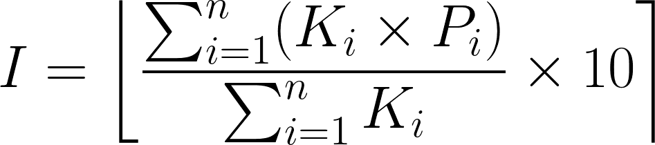
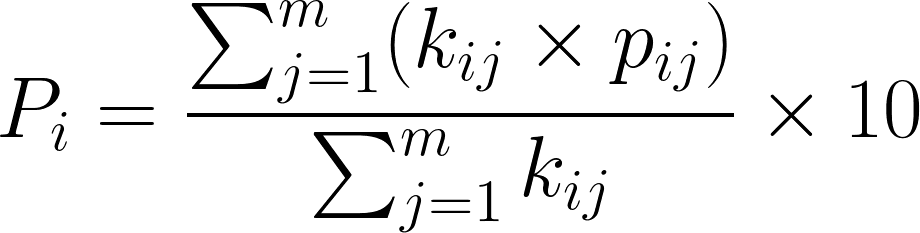
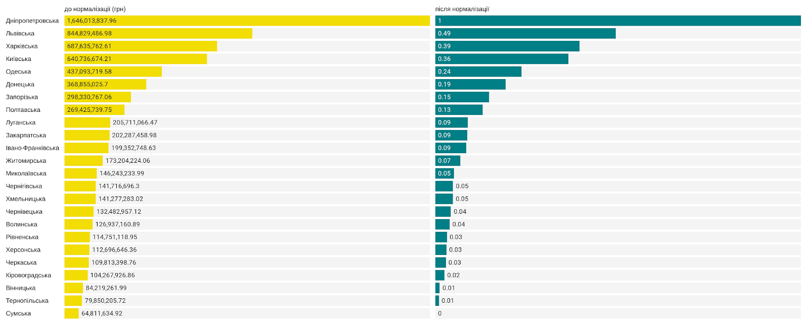
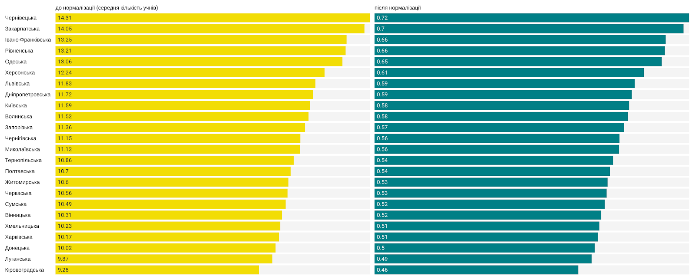
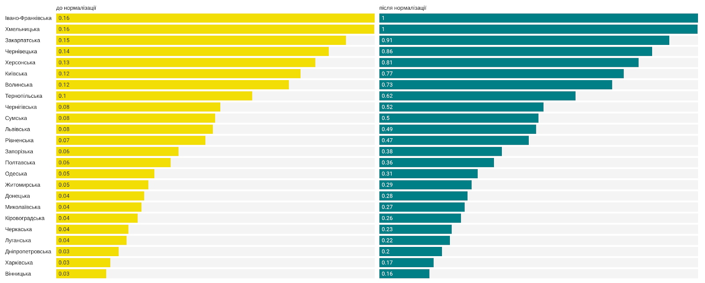
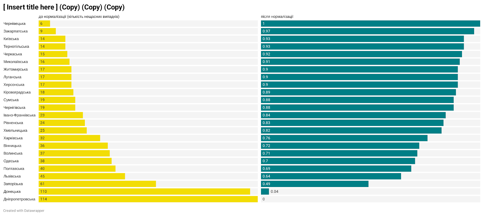

Методологія
===========

Перший рівень

Ця частина окреслює принципи побудови індексу, 
використані в поточній версії параметри, 
а також вказує на особливості збору даних. 

Принципи
--------

Другий рівень

Параметри
---------

Другий рівень

Верхній рівень
^^^^^^^^^^^^^^

Третій рівень

Нижній рівень
^^^^^^^^^^^^^^

Третій рівень

Формули
-------

Введення

Параметр врехнього рівня
^^^^^^^^^^^^^^^^^^^^^^^^

де: 

- `I`  - індекс оцінки діяльності ОДА
- `Pi` - галузевий параметр
- `Ki` - коефіцієнт важливості (за замовчанням дорівнює 1)
- `n` - кількість галузевих параметрів (наразі, згідно із ЗУ “Про місцеві державні адміністрації”, їх 8)

Параметр нижнього рівня
^^^^^^^^^^^^^^^^^^^^^^^

де: 

- `Pi` - галузевий параметр
- `pij` - нормалізований на проміжку [0;1] параметр нижнього рівня (докладніше про принципами нормалізації нижче)
- `kij` - коефіцієнт важливості (за замовчанням дорівнює 1)
- `m` - кількість параметрів нижнього рівня, що використовуються для розрахунку галузевого параметру

Нормалізація
^^^^^^^^^^^^

`Min-max normalization` означає перетворення набору значень до певної шкали за такою формулою:

де 

- `x` - набір значень
- `a` та `b` - мінімальне та максимальне значення `x`

Для розрахунку індексу використовується декілька способів такої нормалізації.

Способи нормалізації
""""""""""""""""""""

0. Нормалізація `не потрібна` у тих випадках, коли показник сам по собі визначений у межах [0;1]
1. `Відносна` нормалізація: межі визначаються, як максимальний та мінімальний показник серед регіонів
2. `Нормативна` нормалізація: межі задаються на основі цільових показників
3. `Змішана` нормалізація: одна з меж задається за відносним принципом, інша - за нормативним

`Зворотна` нормалізація використовується для будь-яких способів нормалізації у випадках, 
коли вище емпіричне значення означає нижче значення нормалізованого показника 
(як у випадку з рівнем безробіття чи кількістю нещасних випадків) 

У чинній версії індексу переважно використовується відносна нормалізація, проте 
потрібно докладати зусиль для того, щоб більше показників можна було нормалізувати 
на основі цільових показників, визначеними конкретними документами -- наприклад, 
Державною стратегією регіонального розвитку.

Візуальна ілюстрація способів нижче:

**Відносна нормалізація**
 

.. centered:: Межі визначаються, як максимальний та мінімальний показник серед регіонів

**Нормативна нормалізаця**

.. centered:: Межі задаються на основі цільових показників

**Змішана нормалізаця**

.. centered:: Одна з меж задається за відносним принципом, інша -- за нормативним

**Зворотна нормалізаця**

.. seealso::

    :ref:`sourcecode`: втілення нормалізації в ``Python``

Збір даних
----------
